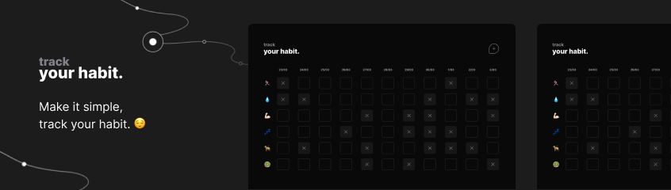

<h1 align="center"> your habit. </h1>

<p align="center">
Make it simple, track your habit. <br/>
</p>

<p align="center">
  <a href="#-technologies">Technologies</a>&nbsp;&nbsp;&nbsp;|&nbsp;&nbsp;&nbsp;
  <a href="#-about">About</a>&nbsp;&nbsp;&nbsp;|&nbsp;&nbsp;&nbsp;
  <a href="#-layout">Layout</a>&nbsp;&nbsp;&nbsp;|&nbsp;&nbsp;&nbsp;
  <a href="#-installation">Installation</a>
</p>

<p align="center">
  
</p>

## 🚀 Technologies

This project was developed with the following technologies:

- ``HTML`` & ``CSS``
- ``JavaScript`` & ``NLW Scripts``
- ``Git`` & ``Github``
-  ``Figma``

## 📖 About 

### Description
In this web application you can control your habit. It is simple and offer the user a simple and friendly UI, easy to use.

### Objective
Learn and practice the following languages: HTML, CSS, JavaScript, NLW Script and the design platform Figma. 

## 🔖 Layout

You can view the layout of the project through [in here](https://www.figma.com/file/mnN27Zo6TktKgjSOVzj8PS/your-habit.?node-id=0%3A1&t=xBLPzTqkToOzygc6-1). You must have an account at [Figma](https://figma.com) to access it. In this case it is just a template layout because it was made after the build was complete.

## 🛠 Installation

```bash
# Open "index.html" and start doing your habit. 

```

## 📫 Contribute
To contribute to your-habit, follow these steps:
1. Fork this repository.
2. Create a branch: `git checkout -b <branch_name>`.
3. Make your changes and commit them: `git commit -m '<commit_message>'`
4. Push to original branch: `git push origin <project_name> / <location>`
5. Create the pull request.
Alternatively, see the GitHub documentation at [how to create a pull request](https://help.github.com/en/github/collaborating-with-issues-and-pull-requests/creating-a-pull-request ).

## :memo: Licence

This project is licensed under the MIT license.

---

Made with ♥ by [Gonçalo Pinto](https://github.com/devgoncalo)
